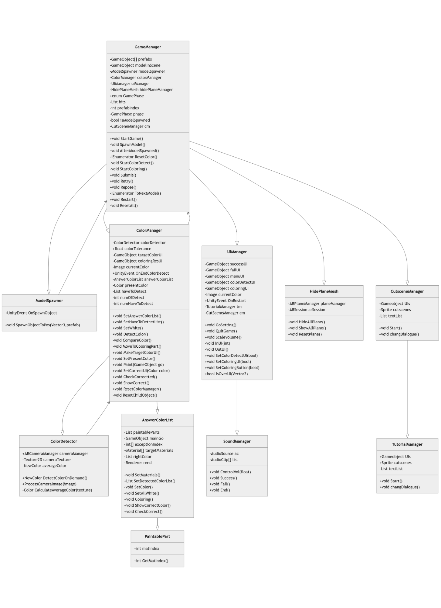
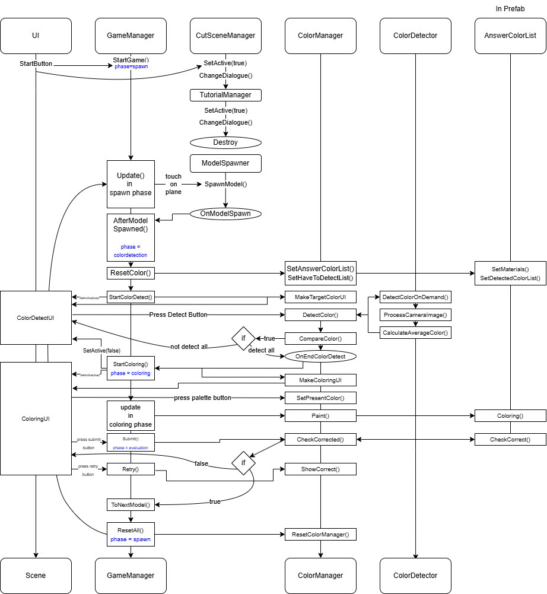

# Immersive Media Programming - AR Team Project

## Team 3 - NO COLOR LAND

---

### Description

#### Concepts

Scanning colors from real life with the camera (Color Mining)
Placing 3D-models in real life using plane detection and coloring them (Coloring 3D Models)

#### Main Components

**Adventure:** For mining color, you have to explore the environment.
**Creativity:** High creativity is needed in the color detection process. Players should find many colors in their surroundings and demonstrate their creativity for it.
**Memory:** Players should remember colors of 3D models.
**Storyline:** The user becomes a person of the “No Color Land”. Also, they will struggle to save the village.

#### Key Features for Development

**Detection:** Need to detect the color of the real world through the camera.
**UI/UX:** Have to make intuitive and conceptual UI for user experience.
**Interaction:** Need to create natural, variable interactions in AR environments.

---

### System Architecture

#### Scenes

**ColorMining (이상민)**
Combining entire of game scene.

#### Prefabs

- **Burger (이주현)**

  > Download at Sketchfab. Added some script.

- **Horse (이주현)**

  > Download at Sketchfab. Added some Collider and script.

- **Goose (이주현)**

  > Download at Sketchfab. Added some Collider and script.

- **TutorialUI (IINES)**

  > UI Prefab for the tutorial.

- **CutsceneUI (IINES)**

  > UI Prefab for the Visual Novel Cutscene.

- **UI (박준영)**
  > UI Prefab for the title and menu scene.

#### Scripts

- **AnswerColorList (이상민)**
  > This script handles saving, whitening, restoring and checking the colors of a model's materials to see if the user's painting matches the correct colors.
- **ColorDetector (이상민)**
  > This script captures the central region of the AR Camera feed, calculates the average color, and returns it in real life.
- **ColorManager (이주현)**
  > This script compares the color detected by the camera with the target color list, allows painting if matched, and triggers an event when all colors are successfully detected.
- **GameManager (이상민)**
  > This script manages the overall flow of an AR-based coloring game, controlling each phase—from model placement to color detection, coloring, answer evaluation, and transition to the next model—based on the game state.
- **HidePlaneMesh (이주현)**
  > This script enables or disables the visualization of AR planes and provides a function to reset all detected planes by restarting the AR session.
- **ModelSpawner (이상민)**
  > This script instantiates a prefab at a specified position and triggers an event with the spawned model.
- **NewColor (이상민)**
  > This class stores the target color and detection status, and can trigger a color painting event as part of data and event handling.
- **PaintablePart (이상민)**
  > This script stores and returns the material index of a paintable object.
- **ColorPaletteUI (이주현)**
  > This script provides button UI functions for selecting various custom colors and sends the selected color to the game manager for use.
- **UIManager (박준영)**
  > This script manages the overall game UI, controlling settings, color detection, coloring, success/failure screens, volume adjustment, current color display, and UI transitions.
- **SoundManager(박준영)**
  > This script is a singleton-based sound manager that plays background music and sound effects according to the game state, with fade transitions for smooth audio changes during scene shifts.
- **CutsceneManager(IINES)**
  > This script sequentially displays cutscene text and background images by phase, and activates the tutorial button at the end while allowing a check on whether the cutscene was watched.
- **TutorialManager(IINES)**
  > This script manages the tutorial by sequentially updating the character’s dialogue and expressions, and activates the start button after the final line.

---

### Diagrams

#### Class Diagram

#### Sequence Diagram

---

### How to Play

- **Cutscene**
  > Players can watch the story script in the cutscene. Players can turn the screen over by touching it.
- **Collecting color part**
  > In the mission, some colors are assigned to players Players find the colors in the real world, then scan them in specific order. (with touching button) When players scan the assigned color in the right order (color mining), they get points!
- **Coloring 3D model part**
  > To accomplish other missions, players should complete and place 3D models in the real world. 3D models can be completed by filling the colors they collected (color restoring).

---

### Borrowed Assets

#### 3D Models

- [Goose](https://sketchfab.com/3d-models/goose-low-poly-3318893e41fc4d2f9f497776da95c13a)
- [Horse](https://sketchfab.com/3d-models/-horse-e9f1f7d5684c4e8881eb24a1d57e71b3)
- [Burger](https://sketchfab.com/3d-models/burger-ae07b87675b24418b6763cd18cab83e2)

#### Sound

- [Main BGM and Cutscene](https://assetstore.unity.com/packages/audio/music/orchestral/symphonic-chronicles-music-pack-273832#content)
- [FREE Casual Game SFX Pack | Audio Sound FX | Unity Asset Store (Button)]()

#### Icon

- [Arrow icons created by Freepik - Flaticon](https://www.flaticon.com/free-icons/arrow)
- [Dark Theme UI](https://assetstore.unity.com/packages/2d/gui/dark-theme-ui-199010)
